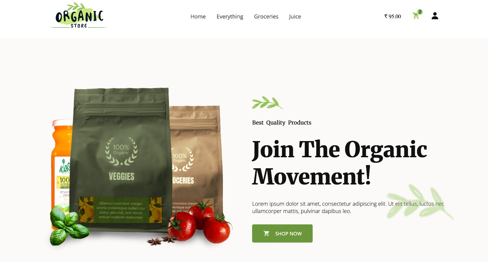
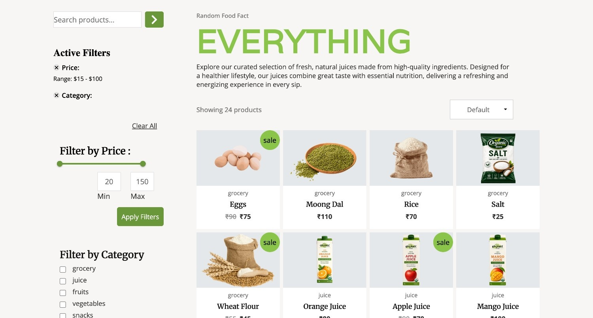
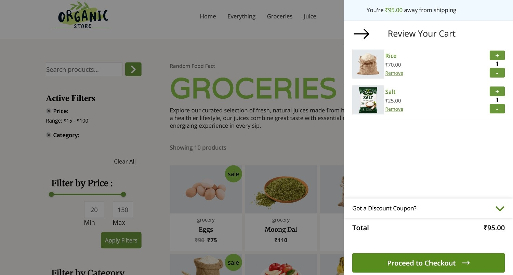
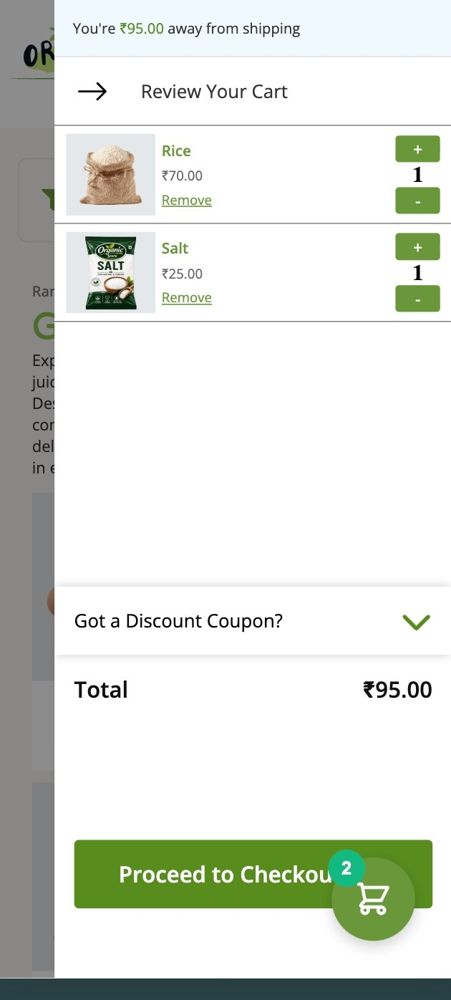
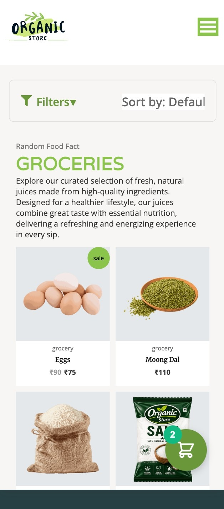

# 🛒 Ecommerce — React Shopping Web App

A modern, responsive ecommerce web application built with **React 19**, **Redux Toolkit**, and **React Router 7**. It features category-based product browsing, live search, sorting, price-range filtering with an MUI slider, infinite scroll, a slide-out cart, and a draggable floating cart button — all backed by a centralized Redux store.

**🔗 Live Demo:** [https://6a4395df49197ccde4672eb7--boisterous-basbousa-db2ddd.netlify.app/](https://6a439cd849197cf17e672ece--organicstored.netlify.app/)

> ⚠️ This is a Netlify **deploy-preview** URL (note the `--` build hash in the subdomain), which can change on every new deploy. Once you set a permanent site name in Netlify, swap this link for your stable production URL (e.g. `your-site-name.netlify.app`).

---

## 📸 Screenshots

| Home Page | Product Listing (Everything) |
|---|---|
|  |  |

| Cart — Desktop View | Cart — Mobile View |
|---|---|
|  |  |

| Grocery Category — Mobile View |
|---|
|  |

---

## ✨ Features

- **Rich homepage** — hero section, feature highlights, featured brands, fresh products showcase, best-selling products, and customer reviews/deal cards
- **Category-based routing** — browse products via dedicated routes (`/everything`, `/groceries`, `/juice`, `/fruits`) with category-specific product detail pages
- **Product filtering & search** — filter by category, price range (via an MUI dual-thumb slider), and live text search
- **Sorting** — sort products by price (low → high / high → low)
- **Infinite scroll** — products load progressively as the user scrolls, with a debounced scroll listener for performance
- **Cart management** — add, view, and manage cart items via a Redux Toolkit slice, with a slide-out cart panel (`SlideCart`) and individual cart item rows
- **Product detail page** — includes a payment card display (`PaymentCard`) showing accepted payment methods (Visa, Mastercard, Amex, UPI)
- **Draggable floating cart button** — a GPU-accelerated, drag-anywhere floating action button (mobile) that toggles the cart panel, using `requestAnimationFrame` + `transform` for smooth dragging
- **Responsive navigation** — collapsible hamburger nav (`HamNav`) for mobile, full nav bar for desktop
- **Client-side routing** — powered by `react-router-dom` v7, including a custom error/404 page and scroll-restoration utility (`ScrollToTop`)
- **Reusable UI components** — product cards, filter badges, sort/filter controls, and shared button primitives (`UI/ShopButton`)

---

## 🛠️ Tech Stack & Packages

This project was scaffolded with [Vite](https://vitejs.dev/) and uses the following packages (from `package.json`):

### Core dependencies

| Package | Version | Purpose |
|---|---|---|
| [`react`](https://www.npmjs.com/package/react) | ^19.2.6 | UI library |
| [`react-dom`](https://www.npmjs.com/package/react-dom) | ^19.2.6 | DOM renderer for React |
| [`react-router-dom`](https://www.npmjs.com/package/react-router-dom) | ^7.18.0 | Client-side routing |
| [`@reduxjs/toolkit`](https://www.npmjs.com/package/@reduxjs/toolkit) | ^2.12.0 | Redux state management (cart, UI toggles) |
| [`react-redux`](https://www.npmjs.com/package/react-redux) | ^9.3.0 | React bindings for Redux |
| [`react-icons`](https://www.npmjs.com/package/react-icons) | ^5.6.0 | Icon set used throughout the UI |
| [`@mui/material`](https://www.npmjs.com/package/@mui/material) | ^9.1.1 | Material UI components (price range slider, Box) |
| [`@emotion/react`](https://www.npmjs.com/package/@emotion/react) | ^11.14.0 | CSS-in-JS engine (MUI peer dependency) |
| [`@emotion/styled`](https://www.npmjs.com/package/@emotion/styled) | ^11.14.1 | Styled-components API for Emotion (MUI peer dependency) |

### Dev dependencies

| Package | Version | Purpose |
|---|---|---|
| [`vite`](https://www.npmjs.com/package/vite) | ^8.0.12 | Build tool & dev server |
| [`@vitejs/plugin-react`](https://www.npmjs.com/package/@vitejs/plugin-react) | ^6.0.1 | React support (Fast Refresh) for Vite |
| [`eslint`](https://www.npmjs.com/package/eslint) | ^10.3.0 | Linting |
| [`@eslint/js`](https://www.npmjs.com/package/@eslint/js) | ^10.0.1 | ESLint base JS config |
| [`eslint-plugin-react-hooks`](https://www.npmjs.com/package/eslint-plugin-react-hooks) | ^7.1.1 | Lint rules for React Hooks |
| [`eslint-plugin-react-refresh`](https://www.npmjs.com/package/eslint-plugin-react-refresh) | ^0.5.2 | Lint rules for React Fast Refresh compatibility |
| [`globals`](https://www.npmjs.com/package/globals) | ^17.6.0 | Global variable definitions for ESLint |
| [`@types/react`](https://www.npmjs.com/package/@types/react) | ^19.2.14 | Type definitions for React (editor support) |
| [`@types/react-dom`](https://www.npmjs.com/package/@types/react-dom) | ^19.2.3 | Type definitions for React DOM (editor support) |

**Total: 9 production dependencies + 9 dev dependencies = 18 directly declared packages** (plus their respective transitive dependencies installed into `node_modules` via npm).

### Other tools

| Category | Technology |
|---|---|
| Styling | CSS Modules |
| Deployment | [Netlify](https://www.netlify.com/) |
| Module system | ESM (`"type": "module"`) |

---

## 📂 Project Structure

```
Ecommerce/
├── public/
│   ├── creditCardsLogo/          # Payment method icons (Visa, Mastercard, Amex, UPI)
│   └── products/                 # Product images by category (fruits, grocery, juice, snacks, vegetables)
├── src/
│   ├── assets/                   # Brand logos, hero images, fresh-product imagery, duplicate product images
│   ├── components/
│   │   ├── Root/                  # App shell: NavBar, HamNav, Footer, SlideCart, FloatingCart, <Outlet/>
│   │   ├── Home/                  # Homepage
│   │   ├── Hero.jsx               # Landing hero section
│   │   ├── Features.jsx           # Feature highlights section
│   │   ├── FeaturedBrands/        # Featured brands carousel/grid
│   │   ├── FreshProducts/         # Fresh products showcase section
│   │   ├── BestSelling/           # Best-selling products section + Product card
│   │   ├── customerReviews/       # Customer review cards + deal cards
│   │   ├── Everything/            # Product listing page (category-aware)
│   │   │   ├── FilterSection/     # Search, price slider, category checkboxes
│   │   │   │   └── FilterBadge/   # Active filter chips
│   │   │   └── ProductSection/    # Sorting, infinite scroll, product grid
│   │   │       └── PageButton/    # Pagination control
│   │   ├── ProductPage/           # Single product detail view + PaymentCard
│   │   ├── SlideCart/             # Slide-out cart drawer
│   │   │   └── CartItems/         # Individual cart line item
│   │   ├── FloatingCart.jsx       # Draggable floating cart button
│   │   ├── NavBar.jsx             # Desktop navigation bar
│   │   ├── HamNav.jsx             # Mobile hamburger navigation
│   │   ├── UI/                    # Shared UI primitives (ShopButton, etc.)
│   │   ├── Demo/                  # Sandbox/demo component
│   │   └── ErrorPage/             # 404 / route error fallback
│   ├── store/                     # Redux store + slices (cart-slice, toogle-cart-slice)
│   ├── data/                      # Static product data (productList.js)
│   ├── util/                      # Shared utilities (ScrollToTop, util.js)
│   ├── App.jsx                    # Route definitions
│   └── main.jsx                   # App entry point
├── index.html
├── vite.config.js
├── eslint.config.js
└── package.json
```

---

## 🚀 Getting Started

### Prerequisites

- [Node.js](https://nodejs.org/) v18+ (v22 recommended — this is what's used in the Netlify build environment)
- npm (comes with Node.js)

### Installation

1. **Clone the repository**
   ```bash
   git clone https://github.com/Kunal0x7/Ecommerce.git
   cd Ecommerce
   ```

2. **Install dependencies**
   ```bash
   npm install
   ```

3. **Start the development server**
   ```bash
   npm run dev
   ```
   The app will be available at `http://localhost:5173` (default Vite port).

4. **Lint the project**
   ```bash
   npm run lint
   ```

5. **Build for production**
   ```bash
   npm run build
   ```

6. **Preview the production build locally**
   ```bash
   npm run preview
   ```

---

## ☁️ Deployment

This project is deployed on **Netlify**, with the following build configuration:

- **Build command:** `npm run build`
- **Publish directory:** `dist`

If you fork this repo and deploy your own copy, connect the repository in Netlify and use the same build command / publish directory — no extra environment variables are required since all product data is static (`src/data/productList.js`).

> 💡 Note: Vite/Rolldown builds run on Linux, which is **case-sensitive** for file paths — make sure all your imports match file/folder casing exactly to avoid build failures (`UNRESOLVED_IMPORT` errors).

---

## 🧩 Key Implementation Notes

- **Redux Toolkit slices** manage cart state (items, quantities) and UI state (cart drawer open/closed), keeping components free of manual reducer/action boilerplate.
- **Filters live in component state** (`Everything.jsx`) and are passed down to `FilterSection` and `ProductSection`, which derive the visible product list via `useEffect` based on search query, category, price range, and sort order.
- **Infinite scroll** is implemented with a debounced `scroll` event listener that increments a `pageNo` value in filter state once the user nears the bottom of the page.
- **Route-aware filtering** — category routes like `/groceries` or `/juice` automatically pre-apply the matching category filter based on `location.pathname`.
- **Smooth dragging** on the floating cart button uses `requestAnimationFrame` to batch position updates and CSS `transform` (GPU-accelerated) instead of triggering React re-renders or layout-thrashing `left`/`top` changes on every pointer move.

---

## 🗺️ Roadmap / Ideas for Future Improvements

- [ ] Persist cart state to `localStorage` so it survives page reloads
- [ ] Connect to a real backend/API instead of static product data
- [ ] Add user authentication and order history
- [ ] Add unit/integration tests
- [ ] Persist floating cart button position across sessions
- [ ] Set up a stable production domain on Netlify instead of using the deploy-preview URL

---

## 🤝 Contributing

Contributions, issues, and feature requests are welcome. Feel free to check the [issues page](https://github.com/Kunal0x7/Ecommerce/issues) or open a pull request.

1. Fork the project
2. Create your feature branch (`git checkout -b feature/amazing-feature`)
3. Commit your changes (`git commit -m 'Add some amazing feature'`)
4. Push to the branch (`git push origin feature/amazing-feature`)
5. Open a Pull Request

---

## 📄 License

This project currently has no license specified. Consider adding one (e.g. [MIT](https://choosealicense.com/licenses/mit/)) if you intend for others to reuse the code.

---

## 👤 Author

**Kunal**
GitHub: [@Kunal0x7](https://github.com/Kunal0x7)
